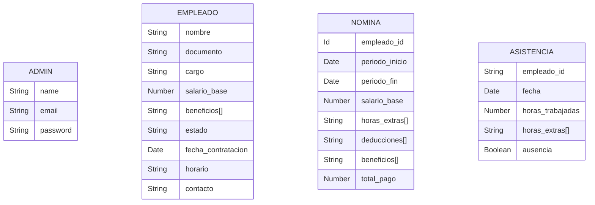

## Stack Tecnológico Backend y Frontend

- [**Backend**](https://github.com/stente3/EasyNomina-back): Node.js, un entorno de ejecución para JavaScript que permite construir aplicaciones escalables y de alto rendimiento.
- [**Frontend**](https://github.com/stente3/EasyNomina-front): React, una biblioteca de JavaScript para construir interfaces de usuario interactivas y reutilizables.
- **Arquitectura**: REST (API), permite una comunicación eficiente y estandarizada entre el frontend y el backend mediante el uso de URLs para la interacción con los recursos.

## Elección de Base de Datos

- **MongoDB Atlas (NoSQL)**: Se hace uso de una base de datos NoSQL, debido a su flexibilidad y escalabilidad, lo cual es ideal para manejar estructuras de datos dinámicas y no estructuradas. MongoDB es conocido por su facilidad de uso y su capacidad para escalar horizontalmente, lo que lo hace apto para aplicaciones con necesidades cambiantes y grandes volúmenes de datos.

## Caso Problema

- **Problema de Nómina en el Restaurante Alaska**: El restaurante Alaska enfrenta problemas significativos en la gestión de la nómina debido a la falta de un sistema automatizado. Los procesos manuales actuales son propensos a errores, generan demoras en los pagos y dificultan el control de horas extras, ausencias y deducciones. Esto afecta tanto la satisfacción del personal como la productividad administrativa. La solución propuesta es una aplicación web que optimice estos procesos, asegurando precisión en los cálculos, facilidad en la consulta de información y mejorando la transparencia y eficiencia en la administración de los recursos humanos. 🚨

## Alcance

Implementar una aplicación web para la gestión de la nómina en el restaurante Alaska ha permitido una administración precisa y eficiente de empleados, usuarios, nóminas y pagos, destacándose por un backend seguro mediante autenticación. Sin embargo, para el futuro, se planea construir y mejorar significativamente el frontend, enfocándose en desarrollar una interfaz intuitiva y fluida que optimice la conectividad visual y de datos, además de fortalecer la seguridad tanto en el frontend como en el backend. Estas mejoras garantizarán una aplicación robusta y satisfactoria tanto para los administradores como para los empleados. 🚀

## Diagrama de Base de Datos

## Roadmap del Proyecto de Gestión de Nómina

### **Fase 1: Análisis y Diseño**

- ✅ **Definición de Requisitos**: Identificación de los desafíos actuales (gestión manual, errores, demoras, etc.) y recopilación de necesidades específicas para la aplicación.

- ✅ **Diseño Inicial**: Elaboración de wireframes y diagramas que muestren la arquitectura de la solución, incluyendo un sistema para que los empleados puedan conectarse y revisar sus nóminas.

- ✅ **Planificación del Desarrollo**: Definición de etapas, herramientas y cronograma.

### **Fase 2: Desarrollo del Sistema**

- ✅ **Desarrollo del Backend**: Creación de un backend robusto para manejar la autenticación, cálculos de nómina, reportes, y acceso de empleados. (Completado)

- ✅ **Configuración de la Base de Datos**: Diseño e implementación de una base de datos eficiente para almacenar información de empleados, pagos, horas trabajadas, beneficios, y credenciales de acceso. (Completado)

- 🚧 **Creación del Frontend Adaptativo**: Desarrollo de una interfaz intuitiva, compatible con múltiples dispositivos, que permita tanto la gestión administrativa como el acceso de empleados para consultar sus nóminas. (En progreso)

### **Fase 3: Funcionalidades de Usuario**

- 🚧 **Automatización de Cálculos**: Implementación de algoritmos para el cálculo automático de pagos, deducciones, horas extras y ausencias. (En progreso)

- ⬜ **Integración de Acceso para Empleados**: Creación de un sistema donde los empleados puedan iniciar sesión de manera segura, consultar sus nóminas, y visualizar detalles como pagos, deducciones y horas trabajadas. (Por hacer)

- ⬜ **Integración de Alertas y Notificaciones**: Configuración de notificaciones automáticas para pagos pendientes, nuevos reportes, y alertas relevantes para los empleados. (Por hacer)

### **Fase 4: Optimización y Pruebas**

- ⬜ **Pruebas Funcionales y de Usabilidad**: Identificación y corrección de errores en el sistema para asegurar un funcionamiento óptimo. (Por hacer)
- ⬜ **Optimización del Frontend Adaptativo**: Mejoras en la experiencia de usuario y diseño visual para una navegación fluida y eficiente. (Por hacer)

- ⬜ **Pruebas de Seguridad**: Verificación de la protección de datos sensibles en el sistema, tanto para administradores como empleados. (Por hacer)
